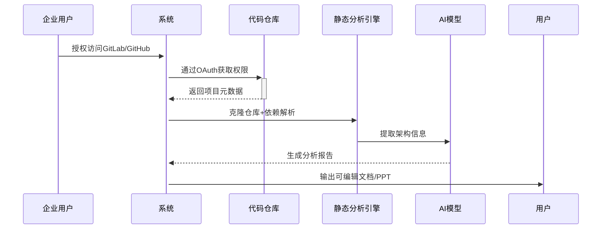
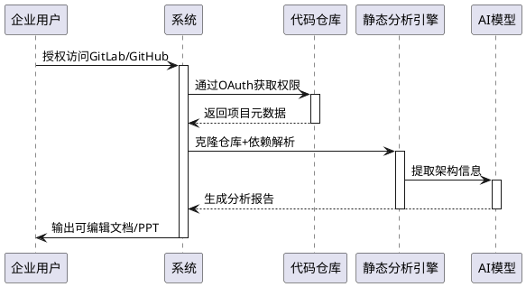

# 程序员晨星项目环境模板
https://www.yuque.com/yuqueyonghutqcgfo/cot236/ba703pmzt53h1vmx#xK9Mp

# ABO网盘开发工具包（pwd：pfd5）
https://cloud.189.cn/web/share?code=baeQZrAjEvyy

# 微聊github项目
https://github.com/wuleds/WeTalk 

# git 指定提交时间
```bash
GIT_COMMITTER_DATE="2024-09-14 08:30:00" git commit --date "2024-09-14 08:30:00" -am "修复登录功能bug"
```

# 更新jar包中配置文件内容

可以使用`uf`参数实现更新`jar`包中文件的内容， 避免出现`jar中没有主清单属性`的问题，保持`jar`包原始完整性：
```shell
# 创建临时目录
mkdir temp_jar
# 解压jar包
cd temp_jar && jar -xf ../springboot-0.0.1-SNAPSHOT.jar && cd ..
# 更新jar包
jar uf springboot-0.0.1-SNAPSHOT.jar -C temp_jar BOOT-INF/classes/application.yml
```

# mermaid 语法生流程图、架构图
url: https://mermaid.live/
提示词：


# pluntuml 语法生成流程图
url: https://www.planttext.com/



# idea 重装删注册表
```bash
计算机\HKEY_CURRENT_USER\SOFTWARE\JavaSoft\Prefs\jetbrains
```

# docker
## Windows 自定义路径安装 Docker Desktop

```bash
.\"Docker Desktop Installer.exe" install -accept-license --installation-dir="D:\docker\Docker" --wsl-default-data-root="D:\docker\data" --windows-containers-default-data-root="D:\\docker\\Docker"
```

## 加速镜像
[阿里云的专属镜像加速器](https://cr.console.aliyun.com/cn-hangzhou/instances/mirrors)
```json
# vi /etc/docker/daemon.json
# 原来的配置：
{
  "registry-mirrors": ["https://y5u7p3c7.mirror.aliyuncs.com"]
}

# 换用下面的配置，目前2024.07.15可用
{
  "registry-mirrors": [
      "https://docker.xuanyuan.me",
      "https://docker.1panel.live",
      "https://docker.m.daocloud.io",
      "https://dockerproxy.com",
      "https://docker.mirrors.ustc.edu.cn",
      "https://docker.nju.edu.cn"
  ]
}

# 重启docker
systemctl daemon-reload
systemctl restart docker
```

## 使用代理
### 简单方案
```bash
# 编辑配置文件 vi /etc/docker/daemon.json

{
  "registry-mirrors": [
    "https://docker.m.daocloud.io",
  ],
  "proxies": {
    "http-proxy": "http://192.168.8.1:7890",
    "https-proxy": "http://192.168.8.1:7890"
  }
}
```

### 详细方案


# 学了一个新的命令

```bash
# 覆盖原文
tee /path/to/yourfile.txt <<EOF
文件内容
EOF
# 在后面追加
tee -a /path/to/yourfile.txt <<EOF
文件内容
EOF
```

> 给出的命令使用了 `tee` 命令，这是一个非常实用的命令，它可以从标准输入读取数据并将其写入到标准输出以及一个或多个文件中。结合 `<<EOF` 这种 here document（heredoc）语法，它可以用来创建并填充文件，即使该文件位于需要 root 权限的目录下。
>
> 这个命令会创建（或覆盖）位于 `/path/to/yourfile.txt` 的文件，并在里面写入 `文件内容`。由于使用了 `sudo`，所以即使你没有对 `/path` 目录的直接写权限，命令也能成功执行。
>
> 如果文件已经存在并且你不想覆盖它，你可以在 `tee` 命令后加上 `-a` 参数来追加内容而不是覆盖（我的理解是 add ）


# Windows 任务计划程序的一个小 Bug 似乎被我解决了


**背景描述：**当我创建基本任务的时候，选择操作的脚本，总会失败。于是当我点击确认之后，系统会提示我卸载当前单元，如果卸载，那么恭喜进入这个`bug`，如果选择领一个选项，那么就没事。

**解决方案：**
1、打开注册表

2、打开这个路径：HKEY LOCAL MACHINE\SOFTWARE\Microsoft\Windows NT\CurrentVersion\Schedule\TaskCache\Tree

3、在这个文件夹下找到不再存在的任务名，然后右键删除

4、重新打开任务计划程序，发现已经解决

# Maven

## 离线安装中央仓库没有的本地 jar 包
```bash
# 进入到下载好的jar包路径下
mvn install:install-file -Dfile=/path/to/your/jar/file.jar -DgroupId=com.example -DartifactId=your-artifact-id -Dversion=1.0 -Dpackaging=jar

# 例如离线安装alipay sdk
mvn install:install-file -DgroupId=com.alipay -DartifactId=alipay-trade-sdk -Dversion=20161215 -Dpackaging=jar -Dfile=alipay-trade-sdk-20161215.jar
```
## Maven 安装

```bash
# wget 命令
wget https://archive.apache.org/dist/maven/maven-3/3.3.9/binaries/apache-maven-3.3.9-bin.tar.gz
```

## 镜像配置

```xml
  <mirrors>
	  <mirror>
      <id>alimaven</id>
      <mirrorOf>central</mirrorOf>
      <name>阿里云公共仓库</name>
      <url>https://maven.aliyun.com/repository/public</url>
    </mirror>
    <!-- Maven 的默认配置：为了增强安全性与隐私，同时也能够提升性能，因为它会强制Maven使用更安全的HTTPS连接，而不是不加密的HTTP -->
    <mirror>
      <id>maven-default-http-blocker</id>
      <mirrorOf>external:http:*</mirrorOf>
      <name>Pseudo repository to mirror external repositories initially using HTTP.</name>
      <url>http://0.0.0.0/</url>
      <blocked>true</blocked>
    </mirror>
  </mirrors>
```

## JDK配置

要在`Maven`中灵活且可移植地切换JDK版本，使用`settings.xml`中的`<profiles>`是一个很好的解决方案。你可以定义多个`<profile>`，每个`<profile>`对应一个JDK版本，然后通过命令行参数激活特定的`<profile>`。这样，无论你在哪里构建项目，只要`Maven`读取了正确的`settings.xml`，就可以自动应用所需的JDK配置。

下面是一个示例，展示了如何在`settings.xml`中配置两个`<profile>`，一个用于`JDK 1.8`，另一个用于`JDK 11`：

```xml
    <profile>   
      <id>jdk1.8</id>

      <activation>   
        <activeByDefault>true</activeByDefault>
        <jdk>1.8</jdk>   
      </activation>

      <properties>
        <maven.compiler.source>1.8</maven.compiler.source>
        <maven.compiler.target>1.8</maven.compiler.target>
        <maven.compiler.compilerVersion>1.8</maven.compiler.compilerVersion>
        <encoding>UTF-8</encoding>
      </properties>
    </profile>
    <!-- 2024-07-11 增加一个jdk11的配置，可以通过 -P参数 或者直接打开 activeByDefault 属性来选择使用 -->
    <profile>
      <id>jdk11</id>
      <activation>
        <activeByDefault>false</activeByDefault>
        <jdk>11</jdk>
      </activation>
      <properties>
        <maven.compiler.source>11</maven.compiler.source>
        <maven.compiler.target>11</maven.compiler.target>
        <maven.compiler.compilerVersion>11</maven.compiler.compilerVersion>
      </properties>
    </profile>
```

为了激活这些`<profile>`，有以下几种方法：

1. 手动开启配置文件中的`activeByDefault`标签；
2. 在Maven命令行中使用`-P`参数 + `<profile>`的`<id>`；

```bash
# 例如，要使用`JDK 11`构建项目，可以执行：
mvn clean install -P jdk11
# 要使用`JDK 1.8`，命令则变为：
mvn clean install -P jdk1.8
```

这样，你无需在每个项目的`pom.xml`中显式设置JDK版本，也不必担心不同开发环境之间的移植性问题。

### 注意事项

**使用P参数的优先级高于配置文件中的：`activeByDefault`！！！**

**settings.xml文件可以存储在版本控制系统中，保证所有团队成员使用一致的Maven配置。**

### 代码作用

```xml
# 配置Maven的`maven-compiler-plugin`插件。这些属性告诉Maven编译器插件使用哪个JDK版本来编译源代码，以及生成的目标字节码版本。

这些属性具体含义如下：

- `maven.compiler.source`：源代码的兼容性级别。
- `maven.compiler.target`：生成的目标字节码的兼容性级别。
- `maven.compiler.compilerVersion`：编译器的版本，应与`source`和`target`的值相匹配。
<properties>
    <maven.compiler.source>11</maven.compiler.source>
    <maven.compiler.target>11</maven.compiler.target>
    <maven.compiler.compilerVersion>11</maven.compiler.compilerVersion>
</properties>

# `java.version`属性主要用于设置JVM的版本，它影响的是项目运行时所依赖的JVM版本。这个属性是Maven 3.6.0之后引入的，用于支持多版本JRE运行时的项目打包和部署。它被maven-jar-plugin和maven-shade-plugin等插件用来确定运行时JVM的最低版本。
<java.version>1.8</java.version>
```

# Mac安装brew

[https://www.cnblogs.com/liyihua/p/12753163.html](https://www.cnblogs.com/liyihua/p/12753163.html)

```bash
/bin/zsh -c "$(curl -fsSL https://gitee.com/cunkai/HomebrewCN/raw/master/Homebrew.sh)"
```